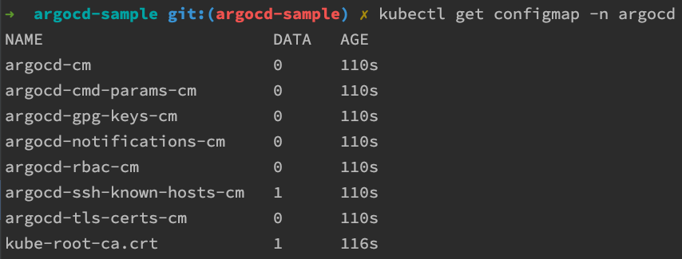

# 'Docker + Git + Minikube + Argo CD' Automatically Deploy Pipeline Sample

## 파이프라인 구성 순서

### K8s에 배포할 도커 이미지 준비

#### 1. Install Docker Engine

- [Install Docker Engine](https://docs.docker.com/engine/install/)
- [Docker Desktop](https://docs.docker.com/desktop/)

위 링크를 참조하여 `Docker Engine`을 설치하도록 한다.

#### 2. Docker Image Build

```shell
docker build -t <your-docker-username>/<your-image-tag>:<your-image-tag-name> .
```

`docker` 명령어를 이용해 이미지를 빌드한다.

명령어에 대해 자세히 알고 싶다면 아래 링크를 참조하도록 한다.

- [Build, tag, and publish an image](https://docs.docker.com/get-started/docker-concepts/building-images/build-tag-and-publish-an-image/)
- [docker build (legacy builder)](https://docs.docker.com/reference/cli/docker/build-legacy/)를 참조하도록 한다.

#### 3. Docker Image Push to DockerHub

```shell
docker push <your-dockerhub-username>/<your-image-tag>:<your-image-tag-name>
```

`docker` 명령어를 이용해 이미지를 푸시한다.

명령어에 대해 자세히 알고 싶다면 아래 링크를 참조하도록 한다.

- [Build, tag, and publish an image](https://docs.docker.com/get-started/docker-concepts/building-images/build-tag-and-publish-an-image/)
- [docker image push](https://docs.docker.com/reference/cli/docker/image/push/)를 참조하도록 한다.

### K8s 환경 준비

#### 4. Install Minikube

```shell
brew install minikube
```

필자는 MacOS를 사용하기 때문에 위와 같이 설치하였으나 다른 방법을
원한다면 [여기](https://minikube.sigs.k8s.io/docs/start/?arch=%2Fmacos%2Fx86-64%2Fstable%2Fbinary+download)를 참조하도록 한다.

#### 5. Install Kubectl

```shell
brew install kubectl
```

필자는 MacOS를 사용하기 때문에 위와 같이 설치하였으나 다른 방법을 원한다면 [여기](https://kubernetes.io/ko/docs/tasks/tools/)를 참조하도록 한다.

### 배포 환경 준비

#### 6. Install Argo CD & CLI

```shell
kubectl create namespace argocd
kubectl apply -n argocd -f https://raw.githubusercontent.com/argoproj/argo-cd/stable/manifests/install.yaml
```

위 명령어를 이용해서 `Kubernetes`에 `argocd`라는 `namespace`를 생성하고, 거기에 `argocd` 관련 `resource(pod, svc, secret, configmap ...)`를
생성한다.

생성된 `Kubernetes resource`들은 아래 명령어를 이용해서 확인할 수 있다.

```shell
kubectl get pod -n argocd
kubectl get svc -n argocd
kubectl get configmap -n argocd
kubectl get secret -n argocd
```





추가로, 아래 명령어를 이용해서 `argocd CLI`를 설치한다.

```shell
brew install argocd
```

필자는 MacOS를 사용하기 때문에 위와 같이 설치하였으나 다른 방법을
원한다면 [여기](https://argo-cd.readthedocs.io/en/stable/getting_started/#2-download-argo-cd-cli)를 참조하도록 한다.

#### 7. Access The Argo CD API Server

기본적으로 `Argo CD API Server`는 외부로 노출된 IP를 제공하지 않는다.

따라서 Argo CD Server에 접근하기 위해서 API Server 노출 설정을 해주어야 한다.

그리고 `Argo CD API Server`는 `Kubernetes` 위에서 동작할 것이기 때문에, `kubectl`을 이용하거나 `Kubernetes`에 특정 설정을 해주어야 한다.

---

- [Service Type Load Balancer](https://argo-cd.readthedocs.io/en/stable/getting_started/#service-type-load-balancer)

```shell
kubectl patch svc argocd-server -n argocd -p '{"spec": {"type": "LoadBalancer"}}'
```

---

- [Ingress](https://argo-cd.readthedocs.io/en/stable/getting_started/#ingress)
  - [Ingress Configuration](https://argo-cd.readthedocs.io/en/stable/operator-manual/ingress/)

---

- [Port Forwarding](https://argo-cd.readthedocs.io/en/stable/getting_started/#ingress)

```shell
kubectl port-forward svc/argocd-server -n argocd 8080:443
```

---

[문서](https://argo-cd.readthedocs.io/en/stable/getting_started/#3-access-the-argo-cd-api-server)에서는 위 세 가지 방법을 제시하고 있으니,
원하는 방식을 취사 선택하여 사용하도록 한다.

참고로 필자는 `Port Forwarding`을 사용할 것이다.

#### 8. Argo CD Login

기본적으로 주어지는 `Argo CD Server`의 관리자 계정인 `admin`의 초기 비밀번호는 자동생성된다.

그리고 그 초기 비밀번호는 아래 명령어로 확인할 수 있다.

```shell
argocd admin initial-password -n argocd
```

비밀번호를 확인했으면 아래 명령어를 통해 로그인할 수 있다.

```shell
argocd login <ARGOCD_SERVER>
```

하지만 앞서 필자는 포트 포워딩을 사용할 것이라고 했다. 따라서 아래와 같은 순서로 명령어를 실행한다.

```shell
kubectl port-forward -n argocd svc/argocd-server <your-port-number>:443 # `kubectl port-forward -n argocd svc/argocd-server <your-port-number>:80` 도 가능하다.
```


```shell
argocd login localhost:<your-port-number>
```


#### 9. Create An Application From A Git Repository

애플리케이션 배포를 위해 `Git Repository`를 `Argo CD`에 등록(연결)해주어야 한다.

CLI 방식과 UI 방식이 존재하는데, 필자는 UI 방식을 사용하도록 하겠다.

아래와 같이 각자 상황에 알맞게 정보를 입력하고 배포 정보를 생성하도록 한다.

- `Settings`
  - `+ CONNECT REPO`


- `+ New App`


이때, `Resource`의 내용 중에 `path`는 `Kubernetes` 설정 파일이 위치하는 경로를 입력해주어야 하는 점에 유의하도록 한다.

- `CREATE`

필요한 정보를 모두 입력하고 `CREATE` 버튼을 누르면 아래와 같이 `Application` 정보 카드를 볼 수 있다.


### 서버 배포 및 동작 확인

#### 10. Sync (Deploy) The Application

이제 마지막이다.

화면에 보이는 `argocd-sample` 애플리케이션 카드의 `SYNC` 버튼을 누르자.

필자는 `test`라는 `namespace`를 사용할 것이므로 `AUTO-CREATE NAMESPACE` 옵션에 체크하였다.


원하는 `Kubernetes Resource`를 선택하고 상단의 `SYNCHRONIZE` 버튼을 누르면...


짜잔. 아래와 같이 배포가 완료되었다.


`kubectl`을 이용해 아래와 같이 확인할 수 있다.


마지막으로, 아래와 같이 테스트 또한 정상적으로 동작하는 것을 볼 수 있다.


## Apply ArgoCD Image Updater (GitOps)

### ArgoCD Image Updater 적용 순서

#### 1. Installing as Kubernetes workload in Argo CD namespace

ArgoCD Image Updater 관련 resource를 생성, 설치한다.

```shell
kubectl apply -n argocd -f https://raw.githubusercontent.com/argoproj-labs/argocd-image-updater/stable/manifests/install.yaml
```

#### 2. Generate SSH Key

GitHub에 연결할 SSH Key를 생성한다.

```shell
➜  argocd-sample git:(apply-argocd-image-updater) ✗ ssh-keygen -t rsa -b 4096 -C "argocd-image-updater-git-ssh-key" -f ~/.ssh/argocd-image-updater-git-ssh-key

Generating public/private rsa key pair.
Enter passphrase (empty for no passphrase): 
Enter same passphrase again: 
Your identification has been saved in /Users/baejaehong/.ssh/argocd-image-updater-ssh-key
Your public key has been saved in /Users/baejaehong/.ssh/argocd-image-updater-ssh-key.pub
The key fingerprint is:
SHA256:6l1v+dbvRNWNlm1UoxlOG0tm85bUDFN8T+w8OrKZfH8 argocd-image-updater-ssh-key
The key's randomart image is:
+---[RSA 4096]----+
| ...             |
| ...             |
| ...             |
| ...             |
| ...             |
| ...             |
| ...             |
| ...             |
| ...             |
+----[SHA256]-----+
```

#### 3. Create K8s Secret For ArgoCD Image Updater SSH Key

```shell
cd ~/.ssh

kubectl create secret generic argocd-image-updater-git-ssh-key \
  --from-file=argocdImageUpdaterGitSshKey=argocd-image-updater-git-ssh-key \
  -n argocd
```

#### 4. Update ArgoCD ConfigMap

[//]: # (```shell)

[//]: # (kubectl edit configmap argocd-image-updater-config -n argocd)

[//]: # (```)

```shell
#kubectl get configmap argocd-image-updater-config -n argocd -o yaml | pbcopy
kubectl get configmap argocd-image-updater-config -n argocd -o yaml
```

```yaml
# Please edit the object below. Lines beginning with a '#' will be ignored,
# and an empty file will abort the edit. If an error occurs while saving this file will be
# reopened with the relevant failures.
#
apiVersion: v1
kind: ConfigMap
metadata:
  annotations:
    kubectl.kubernetes.io/last-applied-configuration: |
      {"apiVersion":"v1","kind":"ConfigMap","metadata":{"annotations":{},"labels":{"app.kubernetes.io/name":"argocd-image-updater-config","app.kubernetes.io/part-of":"argocd-image-updater"},"name":"argocd-image-updater-config","namespace":"argocd"}}
  creationTimestamp: "2025-07-24T01:44:56Z"
  labels:
    app.kubernetes.io/name: argocd-image-updater-config
    app.kubernetes.io/part-of: argocd-image-updater
  name: argocd-image-updater-config
  namespace: argocd
  resourceVersion: "15892"
  uid: 46bfe0b7-0974-4e83-9ca3-3305c0525ff2

```

아래 내용 추가

```yaml
data:
  GIT_SSH_KEY_PATH: "/app/config/argocd-image-updater/argocdImageUpdaterGitSshKey"
```

resource 적용

```shell
kubectl apply -f k8s/argocd-sample/support/updated-argocd-image-updater-configmap.yaml
```

최종

```shell
kubectl get configmap -n argocd argocd-image-updater-config -o yaml
```

```yaml
apiVersion: v1
kind: ConfigMap
metadata:
  annotations:
    kubectl.kubernetes.io/last-applied-configuration: |
      {"apiVersion":"v1","kind":"ConfigMap","metadata":{"annotations":{},"labels":{"app.kubernetes.io/name":"argocd-image-updater-config","app.kubernetes.io/part-of":"argocd-image-updater"},"name":"argocd-image-updater-config","namespace":"argocd"}}
  creationTimestamp: "2025-08-05T06:47:50Z"
  labels:
    app.kubernetes.io/name: argocd-image-updater-config
    app.kubernetes.io/part-of: argocd-image-updater
  name: argocd-image-updater-config
  namespace: argocd
  resourceVersion: "2295"
  uid: 15d91bf6-da91-4a2a-98bb-c04913470029
data:
  GIT_SSH_KEY_PATH: "/app/config/argocd-image-updater/argocdImageUpdaterGitSshPrivateKey"

```

#### 5. Update ArgoCD Deployment

[//]: # (```shell)

[//]: # (kubectl edit deployment argocd-image-updater -n argocd)

[//]: # (```)

```shell
# kubectl get deployment argocd-image-updater -n argocd -o yaml | pbcopy
kubectl get deployment argocd-image-updater -n argocd -o yaml
```

```yaml
apiVersion: apps/v1
kind: Deployment
metadata:
  annotations:
    deployment.kubernetes.io/revision: "1"
    kubectl.kubernetes.io/last-applied-configuration: |
      {"apiVersion":"apps/v1","kind":"Deployment","metadata":{"annotations":{},"labels":{"app.kubernetes.io/component":"controller","app.kubernetes.io/name":"argocd-image-updater","app.kubernetes.io/part-of":"argocd-image-updater"},"name":"argocd-image-updater","namespace":"argocd"},"spec":{"selector":{"matchLabels":{"app.kubernetes.io/name":"argocd-image-updater"}},"strategy":{"type":"Recreate"},"template":{"metadata":{"labels":{"app.kubernetes.io/name":"argocd-image-updater"}},"spec":{"containers":[{"args":["run"],"env":[{"name":"APPLICATIONS_API","valueFrom":{"configMapKeyRef":{"key":"applications_api","name":"argocd-image-updater-config","optional":true}}},{"name":"ARGOCD_GRPC_WEB","valueFrom":{"configMapKeyRef":{"key":"argocd.grpc_web","name":"argocd-image-updater-config","optional":true}}},{"name":"ARGOCD_SERVER","valueFrom":{"configMapKeyRef":{"key":"argocd.server_addr","name":"argocd-image-updater-config","optional":true}}},{"name":"ARGOCD_INSECURE","valueFrom":{"configMapKeyRef":{"key":"argocd.insecure","name":"argocd-image-updater-config","optional":true}}},{"name":"ARGOCD_PLAINTEXT","valueFrom":{"configMapKeyRef":{"key":"argocd.plaintext","name":"argocd-image-updater-config","optional":true}}},{"name":"ARGOCD_TOKEN","valueFrom":{"secretKeyRef":{"key":"argocd.token","name":"argocd-image-updater-secret","optional":true}}},{"name":"IMAGE_UPDATER_LOGLEVEL","valueFrom":{"configMapKeyRef":{"key":"log.level","name":"argocd-image-updater-config","optional":true}}},{"name":"GIT_COMMIT_USER","valueFrom":{"configMapKeyRef":{"key":"git.user","name":"argocd-image-updater-config","optional":true}}},{"name":"GIT_COMMIT_EMAIL","valueFrom":{"configMapKeyRef":{"key":"git.email","name":"argocd-image-updater-config","optional":true}}},{"name":"GIT_COMMIT_SIGNING_KEY","valueFrom":{"configMapKeyRef":{"key":"git.commit-signing-key","name":"argocd-image-updater-config","optional":true}}},{"name":"GIT_COMMIT_SIGNING_METHOD","valueFrom":{"configMapKeyRef":{"key":"git.commit-signing-method","name":"argocd-image-updater-config","optional":true}}},{"name":"GIT_COMMIT_SIGN_OFF","valueFrom":{"configMapKeyRef":{"key":"git.commit-sign-off","name":"argocd-image-updater-config","optional":true}}},{"name":"IMAGE_UPDATER_KUBE_EVENTS","valueFrom":{"configMapKeyRef":{"key":"kube.events","name":"argocd-image-updater-config","optional":true}}},{"name":"ARGOCD_LOGLEVEL","valueFrom":{"configMapKeyRef":{"key":"log.level","name":"argocd-image-updater-config","optional":true}}}],"image":"quay.io/argoprojlabs/argocd-image-updater:v0.16.0","imagePullPolicy":"Always","livenessProbe":{"httpGet":{"path":"/healthz","port":8080},"initialDelaySeconds":3,"periodSeconds":30},"name":"argocd-image-updater","ports":[{"containerPort":8080}],"readinessProbe":{"httpGet":{"path":"/healthz","port":8080},"initialDelaySeconds":3,"periodSeconds":30},"securityContext":{"allowPrivilegeEscalation":false,"capabilities":{"drop":["ALL"]},"readOnlyRootFilesystem":true,"runAsNonRoot":true,"seccompProfile":{"type":"RuntimeDefault"}},"volumeMounts":[{"mountPath":"/app/config","name":"image-updater-conf"},{"mountPath":"/app/config/ssh","name":"ssh-known-hosts"},{"mountPath":"/app/.ssh","name":"ssh-config"},{"mountPath":"/tmp","name":"tmp"},{"mountPath":"/app/ssh-keys/id_rsa","name":"ssh-signing-key","readOnly":true,"subPath":"sshPrivateKey"}]}],"serviceAccountName":"argocd-image-updater","volumes":[{"configMap":{"items":[{"key":"registries.conf","path":"registries.conf"},{"key":"git.commit-message-template","path":"commit.template"}],"name":"argocd-image-updater-config","optional":true},"name":"image-updater-conf"},{"configMap":{"name":"argocd-ssh-known-hosts-cm","optional":true},"name":"ssh-known-hosts"},{"configMap":{"name":"argocd-image-updater-ssh-config","optional":true},"name":"ssh-config"},{"name":"ssh-signing-key","secret":{"optional":true,"secretName":"ssh-git-creds"}},{"emptyDir":{},"name":"tmp"}]}}}}
  creationTimestamp: "2025-08-05T09:43:49Z"
  generation: 1
  labels:
    app.kubernetes.io/component: controller
    app.kubernetes.io/name: argocd-image-updater
    app.kubernetes.io/part-of: argocd-image-updater
  name: argocd-image-updater
  namespace: argocd
  resourceVersion: "1810"
  uid: 99949b60-d6bb-45fc-af76-05a2d15134aa
spec:
  progressDeadlineSeconds: 600
  replicas: 1
  revisionHistoryLimit: 10
  selector:
    matchLabels:
      app.kubernetes.io/name: argocd-image-updater
  strategy:
    type: Recreate
  template:
    metadata:
      creationTimestamp: null
      labels:
        app.kubernetes.io/name: argocd-image-updater
    spec:
      containers:
        - args:
            - run
          env:
            - name: APPLICATIONS_API
              valueFrom:
                configMapKeyRef:
                  key: applications_api
                  name: argocd-image-updater-config
                  optional: true
            - name: ARGOCD_GRPC_WEB
              valueFrom:
                configMapKeyRef:
                  key: argocd.grpc_web
                  name: argocd-image-updater-config
                  optional: true
            - name: ARGOCD_SERVER
              valueFrom:
                configMapKeyRef:
                  key: argocd.server_addr
                  name: argocd-image-updater-config
                  optional: true
            - name: ARGOCD_INSECURE
              valueFrom:
                configMapKeyRef:
                  key: argocd.insecure
                  name: argocd-image-updater-config
                  optional: true
            - name: ARGOCD_PLAINTEXT
              valueFrom:
                configMapKeyRef:
                  key: argocd.plaintext
                  name: argocd-image-updater-config
                  optional: true
            - name: ARGOCD_TOKEN
              valueFrom:
                secretKeyRef:
                  key: argocd.token
                  name: argocd-image-updater-secret
                  optional: true
            - name: IMAGE_UPDATER_LOGLEVEL
              valueFrom:
                configMapKeyRef:
                  key: log.level
                  name: argocd-image-updater-config
                  optional: true
            - name: GIT_COMMIT_USER
              valueFrom:
                configMapKeyRef:
                  key: git.user
                  name: argocd-image-updater-config
                  optional: true
            - name: GIT_COMMIT_EMAIL
              valueFrom:
                configMapKeyRef:
                  key: git.email
                  name: argocd-image-updater-config
                  optional: true
            - name: GIT_COMMIT_SIGNING_KEY
              valueFrom:
                configMapKeyRef:
                  key: git.commit-signing-key
                  name: argocd-image-updater-config
                  optional: true
            - name: GIT_COMMIT_SIGNING_METHOD
              valueFrom:
                configMapKeyRef:
                  key: git.commit-signing-method
                  name: argocd-image-updater-config
                  optional: true
            - name: GIT_COMMIT_SIGN_OFF
              valueFrom:
                configMapKeyRef:
                  key: git.commit-sign-off
                  name: argocd-image-updater-config
                  optional: true
            - name: IMAGE_UPDATER_KUBE_EVENTS
              valueFrom:
                configMapKeyRef:
                  key: kube.events
                  name: argocd-image-updater-config
                  optional: true
            - name: ARGOCD_LOGLEVEL
              valueFrom:
                configMapKeyRef:
                  key: log.level
                  name: argocd-image-updater-config
                  optional: true
          image: quay.io/argoprojlabs/argocd-image-updater:v0.16.0
          imagePullPolicy: Always
          livenessProbe:
            failureThreshold: 3
            httpGet:
              path: /healthz
              port: 8080
              scheme: HTTP
            initialDelaySeconds: 3
            periodSeconds: 30
            successThreshold: 1
            timeoutSeconds: 1
          name: argocd-image-updater
          ports:
            - containerPort: 8080
              protocol: TCP
          readinessProbe:
            failureThreshold: 3
            httpGet:
              path: /healthz
              port: 8080
              scheme: HTTP
            initialDelaySeconds: 3
            periodSeconds: 30
            successThreshold: 1
            timeoutSeconds: 1
          resources: {}
          securityContext:
            allowPrivilegeEscalation: false
            capabilities:
              drop:
                - ALL
            readOnlyRootFilesystem: true
            runAsNonRoot: true
            seccompProfile:
              type: RuntimeDefault
          terminationMessagePath: /dev/termination-log
          terminationMessagePolicy: File
          volumeMounts:
            - mountPath: /app/config
              name: image-updater-conf
            - mountPath: /app/config/ssh
              name: ssh-known-hosts
            - mountPath: /app/.ssh
              name: ssh-config
            - mountPath: /tmp
              name: tmp
            - mountPath: /app/ssh-keys/id_rsa
              name: ssh-signing-key
              readOnly: true
              subPath: sshPrivateKey
      dnsPolicy: ClusterFirst
      restartPolicy: Always
      schedulerName: default-scheduler
      securityContext: {}
      serviceAccount: argocd-image-updater
      serviceAccountName: argocd-image-updater
      terminationGracePeriodSeconds: 30
      volumes:
        - configMap:
            defaultMode: 420
            items:
              - key: registries.conf
                path: registries.conf
              - key: git.commit-message-template
                path: commit.template
            name: argocd-image-updater-config
            optional: true
          name: image-updater-conf
        - configMap:
            defaultMode: 420
            name: argocd-ssh-known-hosts-cm
            optional: true
          name: ssh-known-hosts
        - configMap:
            defaultMode: 420
            name: argocd-image-updater-ssh-config
            optional: true
          name: ssh-config
        - name: ssh-signing-key
          secret:
            defaultMode: 420
            optional: true
            secretName: ssh-git-creds
        - emptyDir: {}
          name: tmp
status:
  availableReplicas: 1
  conditions:
    - lastTransitionTime: "2025-08-05T09:43:49Z"
      lastUpdateTime: "2025-08-05T09:44:19Z"
      message: ReplicaSet "argocd-image-updater-58b99669dd" has successfully progressed.
      reason: NewReplicaSetAvailable
      status: "True"
      type: Progressing
    - lastTransitionTime: "2025-08-06T01:27:14Z"
      lastUpdateTime: "2025-08-06T01:27:14Z"
      message: Deployment has minimum availability.
      reason: MinimumReplicasAvailable
      status: "True"
      type: Available
  observedGeneration: 1
  readyReplicas: 1
  replicas: 1
  updatedReplicas: 1

```

volumes에 아래 내용 추가

```yaml
spec:
  template:
    spec:
      volumes:
        - name: argocd-image-updater-git-ssh-key
          secret:
            secretName: argocd-image-updater-git-ssh-key
```


volumeMounts에 아래 내용 추가


```yaml
spec:
  template:
    spec:
      containers:
        volumeMounts:
          - mountPath: /app/config/argocd-image-updater/argocdImageUpdaterGitSshKey
            name: argocd-image-updater-git-ssh-key
            readOnly: true
```

env에 아래 내용 추가

```yaml
spec:
  template:
    spec:
      containers:
        env:
          - name: GIT_SSH_KEY_PATH
            value: /app/config/argocd-image-updater/argocdImageUpdaterGitSshKey
```

resource 적용

```shell
kubectl apply -f k8s/argocd-sample/support/updated-argocd-image-updater-deployment.yaml
```

최종

```shell
kubectl get deployment argocd-image-updater -n argocd -o yaml
```

```yaml
apiVersion: apps/v1
kind: Deployment
metadata:
  annotations:
    deployment.kubernetes.io/revision: "1"
    kubectl.kubernetes.io/last-applied-configuration: |
      {"apiVersion":"apps/v1","kind":"Deployment","metadata":{"annotations":{},"labels":{"app.kubernetes.io/component":"controller","app.kubernetes.io/name":"argocd-image-updater","app.kubernetes.io/part-of":"argocd-image-updater"},"name":"argocd-image-updater","namespace":"argocd"},"spec":{"selector":{"matchLabels":{"app.kubernetes.io/name":"argocd-image-updater"}},"strategy":{"type":"Recreate"},"template":{"metadata":{"labels":{"app.kubernetes.io/name":"argocd-image-updater"}},"spec":{"containers":[{"args":["run"],"env":[{"name":"APPLICATIONS_API","valueFrom":{"configMapKeyRef":{"key":"applications_api","name":"argocd-image-updater-config","optional":true}}},{"name":"ARGOCD_GRPC_WEB","valueFrom":{"configMapKeyRef":{"key":"argocd.grpc_web","name":"argocd-image-updater-config","optional":true}}},{"name":"ARGOCD_SERVER","valueFrom":{"configMapKeyRef":{"key":"argocd.server_addr","name":"argocd-image-updater-config","optional":true}}},{"name":"ARGOCD_INSECURE","valueFrom":{"configMapKeyRef":{"key":"argocd.insecure","name":"argocd-image-updater-config","optional":true}}},{"name":"ARGOCD_PLAINTEXT","valueFrom":{"configMapKeyRef":{"key":"argocd.plaintext","name":"argocd-image-updater-config","optional":true}}},{"name":"ARGOCD_TOKEN","valueFrom":{"secretKeyRef":{"key":"argocd.token","name":"argocd-image-updater-secret","optional":true}}},{"name":"IMAGE_UPDATER_LOGLEVEL","valueFrom":{"configMapKeyRef":{"key":"log.level","name":"argocd-image-updater-config","optional":true}}},{"name":"GIT_COMMIT_USER","valueFrom":{"configMapKeyRef":{"key":"git.user","name":"argocd-image-updater-config","optional":true}}},{"name":"GIT_COMMIT_EMAIL","valueFrom":{"configMapKeyRef":{"key":"git.email","name":"argocd-image-updater-config","optional":true}}},{"name":"GIT_COMMIT_SIGNING_KEY","valueFrom":{"configMapKeyRef":{"key":"git.commit-signing-key","name":"argocd-image-updater-config","optional":true}}},{"name":"GIT_COMMIT_SIGNING_METHOD","valueFrom":{"configMapKeyRef":{"key":"git.commit-signing-method","name":"argocd-image-updater-config","optional":true}}},{"name":"GIT_COMMIT_SIGN_OFF","valueFrom":{"configMapKeyRef":{"key":"git.commit-sign-off","name":"argocd-image-updater-config","optional":true}}},{"name":"IMAGE_UPDATER_KUBE_EVENTS","valueFrom":{"configMapKeyRef":{"key":"kube.events","name":"argocd-image-updater-config","optional":true}}},{"name":"ARGOCD_LOGLEVEL","valueFrom":{"configMapKeyRef":{"key":"log.level","name":"argocd-image-updater-config","optional":true}}}],"image":"quay.io/argoprojlabs/argocd-image-updater:v0.16.0","imagePullPolicy":"Always","livenessProbe":{"httpGet":{"path":"/healthz","port":8080},"initialDelaySeconds":3,"periodSeconds":30},"name":"argocd-image-updater","ports":[{"containerPort":8080}],"readinessProbe":{"httpGet":{"path":"/healthz","port":8080},"initialDelaySeconds":3,"periodSeconds":30},"securityContext":{"allowPrivilegeEscalation":false,"capabilities":{"drop":["ALL"]},"readOnlyRootFilesystem":true,"runAsNonRoot":true,"seccompProfile":{"type":"RuntimeDefault"}},"volumeMounts":[{"mountPath":"/app/config","name":"image-updater-conf"},{"mountPath":"/app/config/ssh","name":"ssh-known-hosts"},{"mountPath":"/app/.ssh","name":"ssh-config"},{"mountPath":"/tmp","name":"tmp"},{"mountPath":"/app/ssh-keys/id_rsa","name":"ssh-signing-key","readOnly":true,"subPath":"sshPrivateKey"}]}],"serviceAccountName":"argocd-image-updater","volumes":[{"configMap":{"items":[{"key":"registries.conf","path":"registries.conf"},{"key":"git.commit-message-template","path":"commit.template"}],"name":"argocd-image-updater-config","optional":true},"name":"image-updater-conf"},{"configMap":{"name":"argocd-ssh-known-hosts-cm","optional":true},"name":"ssh-known-hosts"},{"configMap":{"name":"argocd-image-updater-ssh-config","optional":true},"name":"ssh-config"},{"name":"ssh-signing-key","secret":{"optional":true,"secretName":"ssh-git-creds"}},{"emptyDir":{},"name":"tmp"}]}}}}
  creationTimestamp: "2025-08-05T09:43:49Z"
  generation: 1
  labels:
    app.kubernetes.io/component: controller
    app.kubernetes.io/name: argocd-image-updater
    app.kubernetes.io/part-of: argocd-image-updater
  name: argocd-image-updater
  namespace: argocd
  resourceVersion: "1810"
  uid: 99949b60-d6bb-45fc-af76-05a2d15134aa
spec:
  progressDeadlineSeconds: 600
  replicas: 1
  revisionHistoryLimit: 10
  selector:
    matchLabels:
      app.kubernetes.io/name: argocd-image-updater
  strategy:
    type: Recreate
  template:
    metadata:
      creationTimestamp: null
      labels:
        app.kubernetes.io/name: argocd-image-updater
    spec:
      containers:
        - args:
            - run
          env:
            - name: GIT_SSH_KEY_PATH # 추가!
              value: /app/config/argocd-image-updater/argocdImageUpdaterGitSshKey
            - name: APPLICATIONS_API
              valueFrom:
                configMapKeyRef:
                  key: applications_api
                  name: argocd-image-updater-config
                  optional: true
            - name: ARGOCD_GRPC_WEB
              valueFrom:
                configMapKeyRef:
                  key: argocd.grpc_web
                  name: argocd-image-updater-config
                  optional: true
            - name: ARGOCD_SERVER
              valueFrom:
                configMapKeyRef:
                  key: argocd.server_addr
                  name: argocd-image-updater-config
                  optional: true
            - name: ARGOCD_INSECURE
              valueFrom:
                configMapKeyRef:
                  key: argocd.insecure
                  name: argocd-image-updater-config
                  optional: true
            - name: ARGOCD_PLAINTEXT
              valueFrom:
                configMapKeyRef:
                  key: argocd.plaintext
                  name: argocd-image-updater-config
                  optional: true
            - name: ARGOCD_TOKEN
              valueFrom:
                secretKeyRef:
                  key: argocd.token
                  name: argocd-image-updater-secret
                  optional: true
            - name: IMAGE_UPDATER_LOGLEVEL
              valueFrom:
                configMapKeyRef:
                  key: log.level
                  name: argocd-image-updater-config
                  optional: true
            - name: GIT_COMMIT_USER
              valueFrom:
                configMapKeyRef:
                  key: git.user
                  name: argocd-image-updater-config
                  optional: true
            - name: GIT_COMMIT_EMAIL
              valueFrom:
                configMapKeyRef:
                  key: git.email
                  name: argocd-image-updater-config
                  optional: true
            - name: GIT_COMMIT_SIGNING_KEY
              valueFrom:
                configMapKeyRef:
                  key: git.commit-signing-key
                  name: argocd-image-updater-config
                  optional: true
            - name: GIT_COMMIT_SIGNING_METHOD
              valueFrom:
                configMapKeyRef:
                  key: git.commit-signing-method
                  name: argocd-image-updater-config
                  optional: true
            - name: GIT_COMMIT_SIGN_OFF
              valueFrom:
                configMapKeyRef:
                  key: git.commit-sign-off
                  name: argocd-image-updater-config
                  optional: true
            - name: IMAGE_UPDATER_KUBE_EVENTS
              valueFrom:
                configMapKeyRef:
                  key: kube.events
                  name: argocd-image-updater-config
                  optional: true
            - name: ARGOCD_LOGLEVEL
              valueFrom:
                configMapKeyRef:
                  key: log.level
                  name: argocd-image-updater-config
                  optional: true
          image: quay.io/argoprojlabs/argocd-image-updater:v0.16.0
          imagePullPolicy: Always
          livenessProbe:
            failureThreshold: 3
            httpGet:
              path: /healthz
              port: 8080
              scheme: HTTP
            initialDelaySeconds: 3
            periodSeconds: 30
            successThreshold: 1
            timeoutSeconds: 1
          name: argocd-image-updater
          ports:
            - containerPort: 8080
              protocol: TCP
          readinessProbe:
            failureThreshold: 3
            httpGet:
              path: /healthz
              port: 8080
              scheme: HTTP
            initialDelaySeconds: 3
            periodSeconds: 30
            successThreshold: 1
            timeoutSeconds: 1
          resources: {}
          securityContext:
            allowPrivilegeEscalation: false
            capabilities:
              drop:
                - ALL
            readOnlyRootFilesystem: true
            runAsNonRoot: true
            seccompProfile:
              type: RuntimeDefault
          terminationMessagePath: /dev/termination-log
          terminationMessagePolicy: File
          volumeMounts:
            - mountPath: /app/config
              name: image-updater-conf
            - mountPath: /app/config/ssh
              name: ssh-known-hosts
            - mountPath: /app/.ssh
              name: ssh-config
            - mountPath: /tmp
              name: tmp
            - mountPath: /app/ssh-keys/id_rsa
              name: ssh-signing-key
              readOnly: true
              subPath: sshPrivateKey
            - mountPath: /app/config/argocd-image-updater/argocdImageUpdaterGitSshKey # 추가!
              name: argocd-image-updater-git-ssh-key
              readOnly: true
      dnsPolicy: ClusterFirst
      restartPolicy: Always
      schedulerName: default-scheduler
      securityContext: {}
      serviceAccount: argocd-image-updater
      serviceAccountName: argocd-image-updater
      terminationGracePeriodSeconds: 30
      volumes:
        - name: argocd-image-updater-git-ssh-key # 추가!
          secret:
            secretName: argocd-image-updater-git-ssh-key
        - configMap:
            defaultMode: 420
            items:
              - key: registries.conf
                path: registries.conf
              - key: git.commit-message-template
                path: commit.template
            name: argocd-image-updater-config
            optional: true
          name: image-updater-conf
        - configMap:
            defaultMode: 420
            name: argocd-ssh-known-hosts-cm
            optional: true
          name: ssh-known-hosts
        - configMap:
            defaultMode: 420
            name: argocd-image-updater-ssh-config
            optional: true
          name: ssh-config
        - name: ssh-signing-key
          secret:
            defaultMode: 420
            optional: true
            secretName: ssh-git-creds
        - emptyDir: {}
          name: tmp
status:
  availableReplicas: 1
  conditions:
    - lastTransitionTime: "2025-08-05T09:43:49Z"
      lastUpdateTime: "2025-08-05T09:44:19Z"
      message: ReplicaSet "argocd-image-updater-58b99669dd" has successfully progressed.
      reason: NewReplicaSetAvailable
      status: "True"
      type: Progressing
    - lastTransitionTime: "2025-08-06T01:27:14Z"
      lastUpdateTime: "2025-08-06T01:27:14Z"
      message: Deployment has minimum availability.
      reason: MinimumReplicasAvailable
      status: "True"
      type: Available
  observedGeneration: 1
  readyReplicas: 1
  replicas: 1
  updatedReplicas: 1

```

배포 설정 적용 후 재시작

```shell
kubectl rollout restart deployment argocd-image-updater -n argocd
```

#### 6. Apply Application

ArgoCD가 배포 버전 관리를 하려면 Application으로 등록되어 있어야 한다.

Application 등록

```shell
kubectl apply -f k8s/argocd-sample/argocd-sample-application.yaml
```

#### 6. ArgoCD Image Updater Auto Sync Test

최신 버전의 이미지를 DockerHub에 push → ArgoCD가 관리하는 Application의 버전이 자동으로 업데이트 되는지 확인.

또는 다음 명령어로 수동 실행도 가능:

```shell
kubectl -n argocd exec deploy/argocd-image-updater -- argocd-image-updater run --once
```

아래 명령어로 ArgoCD 업데이트 사이클 결과를 확인할 수 있다.

```shell
kubectl logs deployment/argocd-image-updater -n argocd
```

```shell
time="2025-08-06T02:50:00Z" level=info msg="Starting image update cycle, considering 0 annotated application(s) for update"
time="2025-08-06T02:50:00Z" level=info msg="Processing results: applications=0 images_considered=0 images_skipped=0 images_updated=0 errors=0"
time="2025-08-06T02:52:00Z" level=info msg="Starting image update cycle, considering 0 annotated application(s) for update"
time="2025-08-06T02:52:00Z" level=info msg="Processing results: applications=0 images_considered=0 images_skipped=0 images_updated=0 errors=0"
time="2025-08-06T02:54:00Z" level=info msg="Starting image update cycle, considering 0 annotated application(s) for update"
time="2025-08-06T02:54:00Z" level=info msg="Processing results: applications=0 images_considered=0 images_skipped=0 images_updated=0 errors=0"
```

ArgoCD가 성공적으로 업데이트를 마치면 [.argocd-source-argocd-sample.yaml](k8s%2Fargocd-sample%2F.argocd-source-argocd-sample.yaml)파일에 변경사항(배포 버전)을 커밋한다.

그리고 해당 파일의 이름은 `.argocd-source-<application-name>.yaml` 으로 정해진다.

### 참고 자료

- https://docs.docker.com/engine/install/
- https://docs.docker.com/docker-hub/
- https://minikube.sigs.k8s.io/docs/start/?arch=%2Fmacos%2Fx86-64%2Fstable%2Fbinary+download
- https://kubernetes.io/ko/docs/tasks/tools/
- https://kubernetes.io/docs/reference/generated/kubectl/kubectl-commands
- https://argo-cd.readthedocs.io/en/stable/getting_started/
- https://velog.io/@junsugi/Argo-CD-Image-Updater-%EC%82%AC%EC%9A%A9%ED%95%98%EA%B8%B0-with.-AWS-EKS
- https://argocd-image-updater.readthedocs.io/en/stable/
- https://argocd-image-updater.readthedocs.io/en/stable/install/installation/
- https://argocd-image-updater.readthedocs.io/en/stable/basics/update/
- https://argocd-image-updater.readthedocs.io/en/stable/basics/update-methods/
- https://argocd-image-updater.readthedocs.io/en/stable/basics/update-strategies/
- https://argocd-image-updater.readthedocs.io/en/stable/basics/authentication/
- https://argocd-image-updater.readthedocs.io/en/stable/configuration/applications/
- https://argocd-image-updater.readthedocs.io/en/stable/configuration/images/
- https://argocd-image-updater.readthedocs.io/en/stable/configuration/registries/