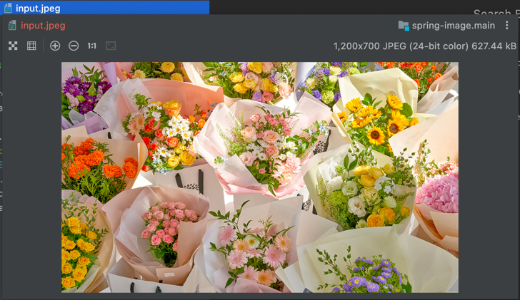
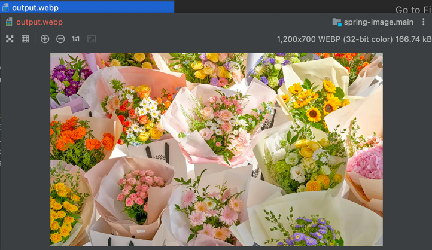

# Spring Image

이미지 처리의 기본적인 것들을 구현한다.

## 필요 의존성

Heic 확장자를 지원하기 위해서는 ImageMagick의 설치가 필요하다.

- [ImageMagick](https://imagemagick.org/)
- [ImageMagick Download](https://imagemagick.org/script/download.php)

### MacOS

```shell
brew install imagemagick
```

### Linux

1. apt (Debian/Ubuntu)

```shell
apt update
apt install -y imagemagick
```

2. apk (Alpine Linux)

```shell
apk update
apk add imagemagick
```

## 이미지 업로드

<details>
<summary>단건 업로드</summary>

```http request
POST /images/upload HTTP/1.1
Host: localhost:8080
Content-Length: 185
Content-Type: multipart/form-data; boundary=----WebKitFormBoundary7MA4YWxkTrZu0gW

------WebKitFormBoundary7MA4YWxkTrZu0gW
Content-Disposition: form-data; name="files"; filename="flowers.jpeg"
Content-Type: image/jpeg

(data)
------WebKitFormBoundary7MA4YWxkTrZu0gW--

```

</details>

<details>
<summary>다중 업로드</summary>

```http request
POST /images/multi-upload HTTP/1.1
Host: localhost:8080
Content-Length: 327
Content-Type: multipart/form-data; boundary=----WebKitFormBoundary7MA4YWxkTrZu0gW

------WebKitFormBoundary7MA4YWxkTrZu0gW
Content-Disposition: form-data; name="files"; filename="flowers.jpeg"
Content-Type: image/jpeg

(data)
------WebKitFormBoundary7MA4YWxkTrZu0gW
Content-Disposition: form-data; name="files"; filename="flower.jpeg"
Content-Type: image/jpeg

(data)
------WebKitFormBoundary7MA4YWxkTrZu0gW--

```

</details>

## 이미지 다운로드

<details>
<summary>Bytes 로 다운로드</summary>

```http request
GET /images/bytes?name=flowers.jpeg HTTP/1.1
Host: localhost:8080
```

</details>

<details>
<summary>Resource 로 다운로드</summary>

```http request
GET /images/resource?name=flowers.jpeg HTTP/1.1
Host: localhost:8080
```

</details>

## 이미지 삭제

<details>
<summary>단건 삭제</summary>

```http request
DELETE /images/flowers.jpeg HTTP/1.1
Host: localhost:8080
```

</details>

## 썸네일 생성

<details>
<summary>썸네일 생성</summary>

```http request
POST /images/thumbnail HTTP/1.1
Host: localhost:8080
Content-Length: 603
Content-Type: multipart/form-data; boundary=----WebKitFormBoundary7MA4YWxkTrZu0gW

------WebKitFormBoundary7MA4YWxkTrZu0gW
Content-Disposition: form-data; name="originImageFile"; filename="flowers.jpeg"
Content-Type: image/jpeg

(data)
------WebKitFormBoundary7MA4YWxkTrZu0gW
Content-Disposition: form-data; name="thumbnailType"

webp
------WebKitFormBoundary7MA4YWxkTrZu0gW
Content-Disposition: form-data; name="thumbnailMaxWidth"

1200
------WebKitFormBoundary7MA4YWxkTrZu0gW
Content-Disposition: form-data; name="thumbnailMaxHeight"

700
------WebKitFormBoundary7MA4YWxkTrZu0gW
Content-Disposition: form-data; name="targetPath"

output.webp
------WebKitFormBoundary7MA4YWxkTrZu0gW--

```

[변환 전 - 1200 x 700, 627.44kB, input.jpeg]



[변환 후 - 1200 x 700, 166.74kB, output.webp]



- webp 타입 처리
- [webp-imageio plugin](https://github.com/sejda-pdf/webp-imageio)

</details>
