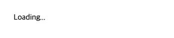
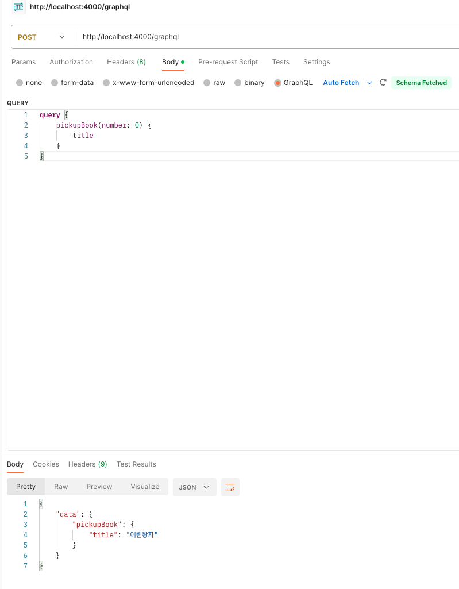
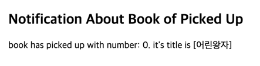

# GraphQL Federation Sample

## 실행 방법

0. 사용할 메시지 채널에 따라 설정 파일(`docker-compose.env`) 내용 수정

- `Kafka` 사용시 `SPRING_PROFILES_ACTIVE=kafka`
- `Redis` 사용시 `SPRING_PROFILES_ACTIVE=redis`

```java
/**
 * @see org.springframework.core.env.SystemEnvironmentPropertySource
 */
```

편의상 서버 기동시에는 `Redis`, `Kafka` 서버 모두 구동되도록 되어있음. `Spring Server` 의 기본값은 `Redis`를 사용하는 것으로 설정되어 있음에 유의.

1. `docker-compose`를 통해 구성 프로젝트 전체 실행

```shell
docker-compose up
```

2. 브라우저 접속 (`http://localhost:3000`)



3. `API Client Tool(e.g. Postman)`을 이용, 게이트웨이 엔드포인트를 통해 `GraphQL Query` 호출



4. 브라우저에서 실시간으로 데이터 갱신되는 것 확인.



## 참고 자료

- [Docker Compose overview](https://docs.docker.com/compose/)
  - [Compose Sepcification Overview](https://docs.docker.com/compose/compose-file/)
  - [Compose Build Specification](https://docs.docker.com/compose/compose-file/build/)
- [Ways to set environment variables in Compose](https://docs.docker.com/compose/environment-variables/set-environment-variables/#cli)
