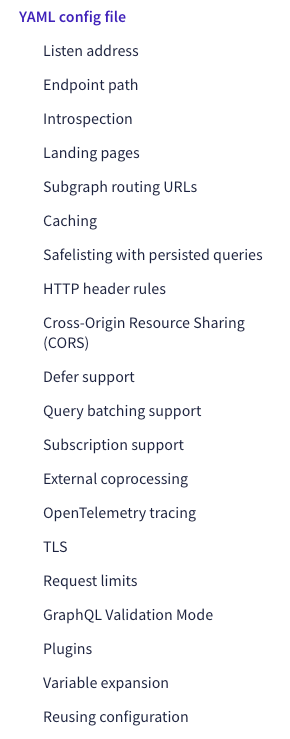

# GraphQL Federation SuperGraph Gateway Sample

## 실행 방법

### Apollo Server, Apollo Router 공통 (1 ~ 3 과정)

> 1. `GraphQL Federation`를 제공하는 서버를 먼저 실행시킨다. 이때 구동되는 서버는 반드시 `subgraph` 역할을 지원하는 것이어야 하며, 해당 기능의 가능 유무에 대한 내용은 아래 참고 자료
     중에서 [Federation-compatible subgraph implementations](https://www.apollographql.com/docs/federation/building-supergraphs/supported-subgraphs/)
     를 참조하도록 한다.

> 2. 본 프로젝트의 `supergraphql.yaml`의 내용에 1번 단계에서 실행시킨 서버의 `routing_url`, `schema.subgraph_url` 을 지정한다.
     이는 [Rover supergraph commands](https://www.apollographql.com/docs/rover/commands/supergraphs)를 참조하도록 한다.

> 3. 본 프로젝트의 `compose_supergraph.sh` 파일을 실행한다.
>
>```shell
>sh compose_supergraph.sh
>```
>
> [결과]
>
> ```text
> $ apollo-server-with-federation-as-a-gateway git:(graphql-federation) ✗ sh compose_supergraph.sh 
> ⌛ resolving SDL for subgraphs defined in ./supergraph.yaml
> 🎶 composing supergraph with Federation v2.5.0
> 📝 Supergraph Schema was printed to supergraph.graphql
> ```

#### `Apollo Server`일 경우

> 4. `npm install` 명령을 실행하지 않았다면 해당 명령어를 실행한다.
>
>```shell
> npm install
>```

> 4. `package.json`의 내용 중에서 목적에 따라 'scripts.start' 의 실행파일 경로를 수정한다.
>
> - `graphql-federation-gateway-standalone-apollo-server.js` : GraphQL Subscription을 제외한 Federation을 사용, Apollo Server 를
    사용할 때.
> - `apollo-federation-gateway-`
>
> ```json
> {
>   "scripts": {
>     "compile": "tsc",
>     "start": "npm run compile && node ./dist/apollo-federation-gateway-standalone.js" 
>   }
> } 
> ```

> 5. 마지막으로 본 프로젝트를 실행한다.
>
>```shell
>npm run start
>```

#### `Apollo Router`일 경우

> 4. `Apollo Router binary`를 설치한다. [Apollo Router quickstart](https://www.apollographql.com/docs/router/quickstart/)
>
> ```shell
> curl -sSL https://router.apollo.dev/download/nix/latest | sh
> ```

> 5. 설치한 `Apollo Router binary`를 실행한다.
>
> ```shell
> ./router
> ```
>
> [결과]
>
>```text
>Apollo Router <version> // (c) Apollo Graph, Inc. // Licensed as ELv2 (https://go.apollo.dev/elv2)
>
>⚠️  The Apollo Router requires a composed supergraph schema at startup. ⚠️
>
>👉 DO ONE:
>
>  * Pass a local schema file with the '--supergraph' option:
>
>      $ ./router --supergraph <file_path>
>
>  * Fetch a registered schema from GraphOS by setting
>    these environment variables:
>
>      $ APOLLO_KEY="..." APOLLO_GRAPH_REF="..." ./router
>
>      For details, see the Apollo docs:
>      https://www.apollographql.com/docs/federation/managed-federation/setup
>
>🔬 TESTING THINGS OUT?
>
>  1. Download an example supergraph schema with Apollo-hosted subgraphs:
>
>    $ curl -L https://supergraph.demo.starstuff.dev/ > starstuff.graphql
>
>  2. Run the Apollo Router in development mode with the supergraph schema:
>
>    $ ./router --dev --supergraph starstuff.graphql
>```
>- 로컬에서 직접 호스팅할 것이므로 `Pass a local schema file with the '--supergraph' option` 문구에 주목할 것.

> 6. 공통 과정 중에서 3번 과정의 결과로 얻은 `supergraph.graphql` 파일을 이용하여 `router`를 실행한다.
>
> 6-1. `YAML config file`이 없이 실행할 경우 (`--dev` 옵션은 development 환경에서만 사용할 것)
> ```shell
> ./router --supergraph supergraph.graphql
> ```
>
> [결과]
>
> ```text
> ➜  apollo-server-with-federation-as-a-gateway git:(graphql-federation) ✗ ./router --supergraph supergraph.graphql               
> 2023-10-24T02:16:52.887308Z  INFO Apollo Router v1.33.1 // (c) Apollo Graph, Inc. // Licensed as ELv2 (https://go.apollo.dev/elv2)
> 2023-10-24T02:16:52.887340Z  INFO Anonymous usage data is gathered to inform Apollo product development.  See https://go.apollo.dev/o/privacy for details.
> 2023-10-24T02:16:53.232700Z  INFO Health check endpoint exposed at http://127.0.0.1:8088/health
> 2023-10-24T02:16:53.233573Z  INFO GraphQL endpoint exposed at http://127.0.0.1:4000/ 🚀
> ```
>
> 6-2. `YAML config file`과 함께 실행할 경우
> ```shell
> ./router --config router.yaml --supergraph supergraph.graphql
> ```
>
> [결과]
>
> ```text
> ➜  apollo-server-with-federation-as-a-gateway git:(graphql-federation) ✗ ./router --config router.yaml --supergraph supergraph.graphql
> 2023-10-24T02:15:18.337906Z  INFO Apollo Router v1.33.1 // (c) Apollo Graph, Inc. // Licensed as ELv2 (https://go.apollo.dev/elv2)
> 2023-10-24T02:15:18.337950Z  INFO Anonymous usage data is gathered to inform Apollo product development.  See https://go.apollo.dev/o/privacy for details.
> 2023-10-24T02:15:18.723950Z  INFO Health check endpoint exposed at http://127.0.0.1:8088/health
> 2023-10-24T02:15:18.725344Z  INFO GraphQL endpoint exposed at http://127.0.0.1:4000/graphql 🚀
> ```
>
> - `GraphQL endpoint exposed at 'http://127.0.0.1:4000/'` 문구에 주목. 해당 엔드포인트로 접속하면 `Federated` 처리된 GraphQL API를 호출할 수 있음.
> - `yaml` 타입의 Config File을 사용할 수 있음.

##### 주의사항

- `supergraph.graphql` 파일의 내용이 비어있으면 실행이 되지 않음에 유의할 것.

## 참고 자료

### Node.js

- [module: esnext should append .js to imports #33588](https://github.com/microsoft/TypeScript/issues/33588)
- [Node.js와 ESM](https://jjnooys.medium.com/node-js%EC%99%80-esm-2462af271156)
- [Node.js와 ESM (2) Typescript 프로젝트 ESM으로 변환하기](https://jjnooys.medium.com/node-js%EC%99%80-esm-2-typescript-%ED%94%84%EB%A1%9C%EC%A0%9D%ED%8A%B8-esm%EC%9C%BC%EB%A1%9C-%EB%B3%80%ED%99%98%ED%95%98%EA%B8%B0-7266e8174906)

### Apollo

- [Get started with Apollo Server](https://www.apollographql.com/docs/apollo-server/getting-started)
- [Implementing a gateway with Apollo Server](https://www.apollographql.com/docs/apollo-server/using-federation/apollo-gateway-setup)
- [Schema composition](https://www.apollographql.com/docs/federation/federated-types/composition/#supported-methods)
- [The Rover CLI](https://www.apollographql.com/docs/rover)
- [Rover supergraph commands](https://www.apollographql.com/docs/rover/commands/supergraphs)
- [Federation-compatible subgraph implementations](https://www.apollographql.com/docs/federation/building-supergraphs/supported-subgraphs/)
- [API Reference: @apollo/gateway](https://www.apollographql.com/docs/apollo-server/using-federation/api/apollo-gateway/)
- [API Reference: ApolloServer](https://www.apollographql.com/docs/apollo-server/api/apollo-server)
- [API Reference: startStandaloneServer](https://www.apollographql.com/docs/apollo-server/api/standalone)
- [API Reference: expressMiddleware](https://www.apollographql.com/docs/apollo-server/api/express-middleware)
- [Does Apollo Federation support subscriptions?](https://support.apollographql.com/hc/en-us/articles/5881531249683-Does-Apollo-Federation-support-subscriptions-)
- [Federated subscriptions in GraphOS: real-time data at scale](https://www.apollographql.com/blog/announcement/backend/federated-subscriptions-in-graphos-real-time-data-at-scale/)
- [Apollo Federation: MAS for GraphQL](https://devstarsj.github.io/development/2023/03/12/Apollo.Federation/)
- [join v0.1 - for defining supergraphs which join multiple subgraphs](https://specs.apollo.dev/join/v0.1/)
- [Apollo Library of Technical Specifications](https://specs.apollo.dev/)
- [Learn GraphQL: What is Federated Architecture?](https://graphql.com/learn/federated-architecture/)
- [Subscriptions in Apollo Server](https://www.apollographql.com/docs/apollo-server/data/subscriptions/)
  - [The WebSocket API (WebSockets)](https://developer.mozilla.org/en-US/docs/Web/API/WebSockets_API)
  - [Subscriptions - Get real-time updates from your GraphQL server](https://www.apollographql.com/docs/react/data/subscriptions)
- [HTTP callback protocol for GraphQL subscriptions](https://www.apollographql.com/docs/router/executing-operations/subscription-callback-protocol/)
- [The router](https://www.apollographql.com/docs/federation/building-supergraphs/router)
  - [Federation 2 quickstart](https://www.apollographql.com/docs/federation/quickstart/setup/)
- [The Apollo Router](https://www.apollographql.com/docs/router/)
  - [Apollo Router quickstart](https://www.apollographql.com/docs/router/quickstart/)
  - [Configuring the Apollo Router](https://www.apollographql.com/docs/router/configuration/overview)
    - 
- [join v0.1 - for defining supergraphs which join multiple subgraphs](https://specs.apollo.dev/join/v0.3/)
- [link v0.1 - for linking schemas together](https://specs.apollo.dev/link/v1.0/)
- [API Reference: Subscription callback plugin](https://www.apollographql.com/docs/apollo-server/api/plugin/subscription-callback)
- [apollosolutions/federation-subscription-tools](https://github.com/apollosolutions/federation-subscription-tools)
