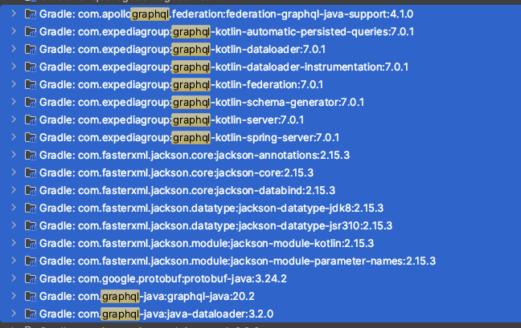

# GraphQL Federation SubGraph GraphQL API Server Sample

## GraphQL 관련 라이브러리 버전 참조

아래 사진은 작성당시 라이브러리 버전 캡쳐.



```kotlin
import org.jetbrains.kotlin.gradle.tasks.KotlinCompile

plugins {
	id("org.springframework.boot") version "3.1.5"
	id("io.spring.dependency-management") version "1.1.3"
	kotlin("jvm") version "1.8.22"
	kotlin("plugin.spring") version "1.8.22"
}

group = "com.banjjoknim"
version = "0.0.1-SNAPSHOT"

java {
	sourceCompatibility = JavaVersion.VERSION_17
}

repositories {
	mavenCentral()
}

dependencies {
	implementation("org.springframework.boot:spring-boot-starter-data-redis-reactive")
	implementation("org.springframework.boot:spring-boot-starter-webflux")
	implementation("com.fasterxml.jackson.module:jackson-module-kotlin")
	implementation("io.projectreactor.kotlin:reactor-kotlin-extensions")
	implementation("org.jetbrains.kotlin:kotlin-reflect")
	implementation("org.jetbrains.kotlinx:kotlinx-coroutines-reactor")
	testImplementation("org.springframework.boot:spring-boot-starter-test")
	testImplementation("io.projectreactor:reactor-test")

	// https://mvnrepository.com/artifact/com.expediagroup/graphql-kotlin-spring-server
	implementation("com.expediagroup:graphql-kotlin-spring-server:7.0.1")
}

tasks.withType<KotlinCompile> {
	kotlinOptions {
		freeCompilerArgs += "-Xjsr305=strict"
		jvmTarget = "17"
	}
}

tasks.withType<Test> {
	useJUnitPlatform()
}

```

## Subscription With Federation Data Graph Architecture 참조


출처 : [apollosolutions/federation-subscription-tools](https://github.com/apollosolutions/federation-subscription-tools)

## 참고 자료

### GraphQL Kotlin (ExpediaGroup)

- [Getting Started](https://opensource.expediagroup.com/graphql-kotlin/docs)
- [GraphQLServer](https://opensource.expediagroup.com/graphql-kotlin/docs/server/graphql-server)
- [GraphQLRequestParser](https://opensource.expediagroup.com/graphql-kotlin/docs/server/graphql-request-parser)
- [GraphQLContextFactory](https://opensource.expediagroup.com/graphql-kotlin/docs/server/graphql-context-factory)
- [GraphQLRequestHandler](https://opensource.expediagroup.com/graphql-kotlin/docs/server/graphql-request-handler)


- [Spring Server Overview](https://opensource.expediagroup.com/graphql-kotlin/docs/server/spring-server/spring-overview)
  - [GraphQL Kotlin Spring Server](https://github.com/ExpediaGroup/graphql-kotlin/tree/master/servers/graphql-kotlin-spring-server)
- [Writing Schemas with Spring](https://opensource.expediagroup.com/graphql-kotlin/docs/server/spring-server/spring-schema)
- [Generating GraphQL Context](https://opensource.expediagroup.com/graphql-kotlin/docs/server/spring-server/spring-graphql-context)
- [Automatically Created Beans](https://opensource.expediagroup.com/graphql-kotlin/docs/server/spring-server/spring-beans)
- [Configuration Properties](https://opensource.expediagroup.com/graphql-kotlin/docs/server/spring-server/spring-properties)
- [Schema Generator - Subscriptions](https://opensource.expediagroup.com/graphql-kotlin/docs/schema-generator/execution/subscriptions/)
- [Spring Server - Subscriptions](https://opensource.expediagroup.com/graphql-kotlin/docs/server/spring-server/spring-subscriptions)

- [GraphQL over WebSocket Protocol](https://github.com/enisdenjo/graphql-ws/blob/master/PROTOCOL.md)

- [Cannot get any subscription back to the consumer(React client / Postman) #938](https://github.com/ExpediaGroup/graphql-kotlin/issues/938)
- [Allow graphql.subscriptions.endpoint to be equals to graphql.endpoint = graphql #484](https://github.com/ExpediaGroup/graphql-kotlin/issues/484)
  - [Is this possible to server websocket handler and normal servlet over same context?](https://stackoverflow.com/questions/48006498/is-this-possible-to-server-websocket-handler-and-normal-servlet-over-same-contex)
  - [Subscriptions in Apollo Server](https://www.apollographql.com/docs/apollo-server/data/subscriptions/)
  - [The WebSocket API (WebSockets)](https://developer.mozilla.org/en-US/docs/Web/API/WebSockets_API)

- [apollosolutions/federation-subscription-tools](https://github.com/apollosolutions/federation-subscription-tools)

### Spring Redis

- [hantsy/spring-reactive-sample/boot-data-redis](https://github.com/hantsy/spring-reactive-sample/tree/master/boot-data-redis)
- [hantsy/spring-reactive-sample/data-redis-message](https://github.com/hantsy/spring-reactive-sample/tree/master/data-redis-message)
- [hantsy/Spring Data Redis](https://hantsy.github.io/spring-reactive-sample/data/data-redis.html)
- [Accessing Data Reactively with Redis](https://spring.io/guides/gs/spring-data-reactive-redis/)
- [PubSub Messaging with Spring Data Redis](https://www.baeldung.com/spring-data-redis-pub-sub)
- [Spring2.x(WebFlux) + ReactiveRedis](https://warpgate3.tistory.com/entry/Spring2xWebFlux-ReactiveRedis)

### etc.

- [Curl command for GraphQL Subscriptions](https://stackoverflow.com/questions/73232291/curl-command-for-graphql-subscriptions)
- [How to read a websocket response with cURL](https://stackoverflow.com/questions/47860689/how-to-read-a-websocket-response-with-curl)
- [Add WebSocket support to WebFlux Functional API (and Kotlin DSL) [SPR-16770] #19476](https://github.com/spring-projects/spring-framework/issues/19476)
- [Subscription on netty http not working #458](https://github.com/spring-projects/spring-graphql/issues/458)

