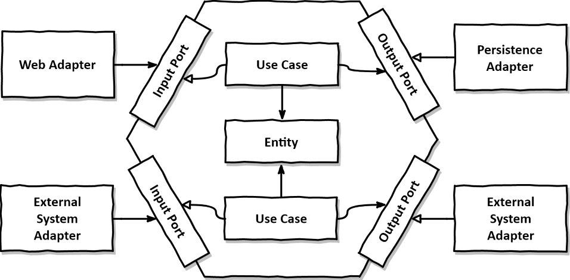

# 만들면서 배우는 클린 아키텍처

- [《만들면서 배우는 클린 아키텍처》 홈페이지](https://wikibook.co.kr/clean-architecture/)
- [《만들면서 배우는 클린 아키텍처》 예제 코드](https://github.com/wikibook/clean-architecture)

## 요구사항

- 회원은 닉네임을 가진다.
- 닉네임은 10글자 이내여야 한다.
- 닉네임은 공백이 아니어야 한다.

## 구현

- 책에서는 계좌 송금 예제를 사용했지만, 회원의 닉네임을 변경하는 예제로 좀 더 심플하게 구성했다.
- 책에서는 `Command` 등의 단어를 사용했지만, 본 예제 코드에서는 `Request`, `Response` 등의 단어로 대체했다.
- 책에서는 `adapter.out.persistence` 내부에 `Entity`가 포함되어 있었지만, 본 예제 코드에서는 `domain.entity` 패키지 내부로 옮겼다.

## 정리

### 계층형 아키텍처

- 데이터베이스 주도 설계를 유도함.
- 영속성 계층과 도메인 계층의 강한 결합이 발생함.
- 영속성 계층은 모든 것에 접근이 가능 -> 결국 모든 계층이 영속성 계층에 의존하게 됨.
- 어느 순간에는 테스트 코드를 작성하는 것보다 의존성을 파악하고 Mocking 하는 데 더 많은 시간이 걸리게 됨. -> 테스트하기 어려워짐.
- 넓은 서비스 문제 -> 특정 유스케이스를 찾는 것이 어려워짐. -> 고도로 특화된 좁은 도메인 서비스(유스케이스별로 분리된 각각의 서비스)로 해결.

> #### *지연되는 소프트웨어 프로젝트에 인력을 더하는 것은 개발을 늦출 뿐이다.*
>
> *<<맨머스 미신: 소프트웨어 공학에 관한 에세이>>, 프레데릭 P. 브룩스*

### 육각형 아키텍처(헥사고날 아키텍처)

- [알리스테어 콕번 - 헥사고날 아키텍처 블로그 원문](https://alistair.cockburn.us/hexagonal-architecture/)

- `포트(port)와 어댑터(adapter) 아키텍처`라고도 불린다.
    - `포트(port)`는 인터페이스로, 계층간 경계를 지정하는 역할을 한다.
    - `포트(port)`는 애플리케이션 서비스와 어댑터 사이의 간접적인 계층이다. 각 계층에 대한 직접적인 코드 의존성을 없애준다.
    - `어댑터(adapter)`는 포트의 구현체이다. 어댑터는 애플리케이션 서비스를 호출하거나, 반대로 애플리케이션 서비스에 의해서 호출되기도 한다.
- `엔티티, 유스케이스, 인커밍/아웃고잉 포트, 인커밍/아웃고잉 어댑터`가 핵심이다.

### 단일 책임 원칙

> #### *하나의 컴포넌트는 오로지 한 가지 일만 해야 하고, 그것을 올바르게 수행해야 한다.*
>#### *컴포넌트를 변경하는 이유는 오직 하나뿐이어야 한다.*

- 책임 -> 변경할 이유
- 단일 책임 원칙 -> 단일 변경 이유 원칙(Single Reason to Change Principal)

### 의존성 역전 원칙

- 도메인 코드는 애플리케이션에서 가장 중요한 코드다. 따라서 의존성을 역전시켜 의존성으로부터 보호(격리)해야 한다.

> #### *코드상의 어떤 의존성이든 그 방향을 바꿀 수(역전시킬 수) 있다.*

- 사실 의존성의 양쪽 코드를 모두 제어할 수 있을 때만 의존성을 역전시킬 수 있다.

> #### *클린 아키텍처에서는 설계가 비즈니스 규칙의 테스트를 용이하게 하고, 비즈니스 규칙은 프레임워크, 데이터베이스, UI 기술, 그 밖의 외부 애플리케이션이나 인터페이스로부터 독립적일 수 있다.*

- 도메인 코드에는 바깥으로 향하는 어떤 의존성도 없어야 한다. 클린 아키텍처에서 모든 의존성은 도메인 로직을 향해 안쪽 방향으로 향해야 한다.

### 패키지 구조

- 본 프로젝트의 패키지 구조를 참고하도록 한다. 각각의 패키지는 핵심 요소들을 표현한다.

### 의존성 주입

- 모든 계층에 의존성을 가진 중립적인 컴포넌트를 하나 도입하여 사용한다. 그렇게 함으로써 핵심 컴포넌트들을 의존성으로부터 보호할 수 있다.

### 입력 유효성 검증

- 입력 모델에서 입력 유효성을 검증하여 애플리케이션 계층에는 온전한 입력만 받도록 한다.
- [Java Bean Validation API](https://beanvalidation.org)

### 유스케이스마다 다른 입력 모델

- 각 유스케이스 전용 입력 모델은 유스케이스를 훨씬 명확하게 만들고 다른 유스케이스와의 결합도 제거해서 불필요한 부수효과가 발생하지 않게 한다.

### 비즈니스 규칙 vs 입력 유효성

- 비즈니스 규칙을 검증하는 것은 도메인 모델의 현재 상태에 접근해야 하지만 입력 유효성은 그럴 필요가 없다.
- 입력 유효성을 검증하는 일은 @NotNull 애너테이션을 붙인 것처럼 선언적으로 구현할 수 있지만 비즈니스 규칙을 검증하는 일은 조금 더 맥락이 필요하다.
- 입력 유효성을 검증하는 것은 `구문상의(syntactical)` 유효성을 검증하는 것이라고 할 수 있다.
- 비즈니스 규칙은 유스케이스의 맥락 속에서 `의미적인(semantical)` 유효성을 검증하는 것이라고 할 수 있다.

### 비즈니스 규칙 검증 구현

- 가장 좋은 방법은 비즈니스 규칙을 도메인 엔티티 안에 넣는 것이다.
- 만약 도메인 엔티티에서 비즈니스 규칙을 검증하기가 어렵다면 유스케이스 코드에서 도메인 엔티티를 사용하기 전에 해도 된다.

### 풍부한 도메인 모델 vs. 빈약한 도메인 모델

- 풍부한 도메인 모델에서는 애플리케이션의 코어에 있는 엔티티에서 가능한 한 많은 도메인 로직이 구현된다. 엔티티들은 상태를 변경하는 메서드를 제공하고, 비즈니스 규칙에 맞는 유효한 변경만을 허용한다.
- 빈약한 도메인 모델에서는 엔티티 자체가 굉장히 얇다. 일반적으로 엔티티는 상태를 표현하는 필드와 이 값을 읽고 바꾸기 위한 getter, setter 메서드만 포함하고 어떤 도메인 로직도 갖고 있지 않다.

### 유스케이스마다 다른 출력 모델

- 출력도 가능하면 각 유스케이스에 맞게 구체적일수록 좋다. 출력은 호출자에게 꼭 필요한 데이터만 들고 있어야 한다.
- 유스케이스들 간에 같은 출력 모델을 공유하게 되면 유스케이스들도 강하게 결합된다. 공유 모델은 장기적으로 봤을 때 갖가지 이유로 점점 커지게 되어 있다.
- 단일 책임 원칙을 적용하고 모델을 분리해서 유지하는 것은 유스케이스의 결합을 제거하는 데 도움이 된다.

### 읽기 전용 유스케이스

- CQS(Command-Query Separation), CQRS(Command-Query Responsibility Segregation)

### 컨트롤러 나누기

- 웹 어댑터는 한 개 이상의 클래스로 구성해도 된다. 단, 클래스들이 같은 소속이라는 것을 표현하기 위해 같은 패키지 수준(hierarchy)에 놓아야 한다.
- 컨트롤러는 너무 적은 것보다는 너무 많은 게 낫다. 각 컨트롤러가 가능한 한 좁고 다른 컨트롤러와 가능한 한 적게 공유하는 웹 어댑터 조각을 구현해야 한다.
- 클래스마다 코드는 적을수록 좋다. 테스트 코드도 마찬가지다. 클래스가 작을수록 더 찾기가 쉽다.
- 모델을 공유하지 않는 여러 작은 클래스들을 만드는 것을 두려워해서는 안 된다. 작은 클래스들은 더 파악하기 쉽고, 더 테스트하기 쉬우며, 동시 작업을 지원한다.

### 인터페이스 나누기

- 하나의 인터페이스에 모든 연산을 모아두면 모든 서비스가 실제로는 필요하지 않은 메서드에 의존하게 된다.

> #### *필요없는 화물을 운반하는 무언가에 의존하고 있으면 예상하지 못했던 문제가 생길 수 있다.*
>
> *로버트 C. 마틴*

- `인터페이스 분리 원칙(Interface Segregation Principle, ISP)`
- 클라이언트가 오로지 자신이 필요로 하는 메서드만 알면 되도록 넓은 인터페이스를 특화된 인터페이스로 분리해야 한다.

### 영속성 어댑터 나누기

- 하나의 애그리거트당 하나의 영속성 어댑터를 만들어서 여러 개의 영속성 어댑터를 만들 수도 있다. 이렇게 하면 영속성 어댑터들은 각 영속성 기능을 이용하는 도메인 경계를 따라 자동으로 나눠진다.
- 영속성 어댑터를 훨씬 많은 클래스로 나눌 수도 있다.

### 영속성, 도메인 모델 타협

- 영속성 측면과의 타협 없이 풍부한 도메인 모델을 생성하고 싶다면 도메인 모델과 영속성 모델을 매핑하는 것이 좋다.

### 테스트 피라미드

- 비용이 많이 드는 테스트는 지양하고 비용이 적게 드는 테스트를 많이 만들어야 한다.
- 단위 테스트, 통합 테스트, 시스템 테스트

### 단위 테스트로 도메인 엔티티 테스트하기

- 도메인 엔티티의 행동은 다른 클래스에 거의 의존하지 않기 때문에 다른 종류의 테스트는 필요하지 않다.

### 단위 테스트로 유스케이스 테스트하기

- 테스트 중인 유스케이스 서비스는 상태가 없기(stateless) 때문에 테스트에서 상태를 검증할 수 없다.
- 대신 의존성의 상호작용을 테스트하기 때문에 통합 테스트에 가깝다. 하지만 목으로 작업하고 실제 의존성을 관리해야 하는 것은 아니기 때문에 완전한 통합 테스트에 비해서는 만들고 유지보수 하기 쉽다.

### 통합 테스트로 웹 어댑터 테스트하기

- `@WebMvcTest`
- 웹 어댑터 테스트는 통합 테스트를 적용하는 것이 합리적이다.
- 사실, 웹 컨트롤러는 스프링 프레임워크에 강하게 묶여 있기 때문에(스프링을 사용한다면) 격리된 상태로 테스트하기보다는 프레임워크와 통합된 상태로 테스트하는 것이 합리적이다.
- 만약 평범하게 단위 테스트로 테스트하면 모든 매핑, 유효성 검증, HTTP 항목에 대한 커버리지가 낮아지고, 프레임워크를 구성하는 요소들이 프로덕션 환경에서 정상적으로 작동할지 확신할 수 없게 된다.

### 통합 테스트로 영속성 어댑터 테스트하기

- `@DataJpaTest`
- 영속성 어댑터의 테스트 역시 단위 테스트보다는 통합 테스트를 적용하는 것이 합리적이다. 단순히 어댑터의 로직만 검증하는 것이 아니라 데이터베이스 매핑도 검증해야하기 때문이다.
- 영속성 어댑터 테스트는 실제 데이터베이스에서 문제가 생길 확률이 높으므로 실제 데이터베이스를 대상으로 진행해야 한다. -> `TestContainer`와 같은 라이브러리의 도움을 받을 수 있다.

### 시스템 테스트로 주요 경로 테스트하기

- 피라미드 최상단에 있는 시스템 테스트는 전체 애플리케이션을 띄우고 API를 통해 요청을 보내고, 모든 계층이 조화롭게 잘 동작하는지 검증한다.
- `TestRestTemplate` -> 실제 HTTP 통신 이용

### 테스트 커버리지

- 라인 커버리지(line coverage)는 테스트 성공을 측정하는 데 있어서는 잘못된 지표다.
    - 코드의 중요한 부분이 전혀 커버되지 않을 수 있음.
- 테스트의 성공 기준 -> 얼마나 마음 편하게 소프트웨어를 배포할 수 있는가?
    - 더 자주 배포할수록 테스트를 더 신뢰할 수 있음.

### 테스트 전략

- 도메인 엔티티를 구현할 때는 단위 테스트로 커버한다.
- 유스케이스를 구현할 때는 단위 테스트로 커버한다.
- 어댑터를 구현할 때는 통합 테스트로 커버한다.
- 사용자가 취할 수 있는 중요 애플리케이션 경로는 시스템 테스트로 커버한다.

> #### *리팩터링할 때마다 테스트 코드도 변경해야 한다면 테스트는 테스트로서의 가치를 잃는다.*

### '매핑하지 않기' 전략

- No Mapping Strategy
- 포트 인터페이스가 도메인 모델을 입출력 모델로 사용하면 두 계층 간의 매핑을 할 필요가 없다.
- 웹, 애플리케이션, 영속성 계층과 관련된 이유로 인해 변경되어야 함. -> 단일 책임 원칙 위배
- 그 결과, 오로지 한 계층에서만 필요한 필드들을 포함하는 파편화된 도메인 모델로 이어질 수 있다.

### '양방향' 매핑 전략

- Two-Way Mapping Strategy
- 각 어댑터가 전용 모델을 가지고 있어서 해당 모델을 도메인 모델로, 도메인 모델을 해당 모델로 매핑할 책임을 가지고 있다.
- 각 계층이 전용 모델을 가지고 있는 덕분에 각 계층이 전용 모델을 변경하더라도 내용이 변경되지 않는 한 다른 계층에는 영향이 없다.

### '완전' 매핑 전략

- Full Mapping Strategy
- 각 연산이 전용 모델을 필요로 한다. 따라서 웹 어댑터와 애플리케이션 계층 각각이 자신의 전용 모델을 각 연산을 실행하는 데 필요한 모델로 매핑한다.
- 각 연산마다 별도의 특화된 입출력 모델을 사용한다.
- 웹 계층과 애플리케이션 계층 사이에서 상태 변경 유스케이스의 경계를 명시할 때 유용하다.
- 애플리케이션 계층과 영속성 계층 사이에서는 매핑 오버헤드 때문에 사용하지 않는 것이 좋다.

### '단방향' 매핑 전략

- One-Way Mapping Strategy
- 동일한 '상태' 인터페이스를 구현하는 도메인 모델과 어댑터 모델을 이용하면 각 계층은 다른 계층으로부터 온 객체를 단방향으로 매핑하기만 하면 된다.
- 모든 계층의 모델들이 같은 인터페이스를 구현한다. 이 인터페이스는 관련 있는 특성(attribute)에 대한 getter 메서드를 제공해서 도메인 모델의 상태를 캡슐화 한다.

### 설정 컴포넌트

- 유스케이스는 인터페이스만 알아야 하고, 런타임에 이 인터페이스의 구현을 제공받아야 한다.
- 애플리케이션의 나머지 부분을 깔끔하게 유지하고 싶다면 아키텍처에 대해 중립적이고 인스턴스 생성을 위해 모든 클래스에 대한 의존성을 가지는 설정 컴포넌트(configuration component)가 필요하다.
- 스프링의 클래스패스 스캐닝 방식
- 스프링의 자바 컨피그 설정 방식

### 소프트웨어 아키텍처

> #### *소프트웨어 아키텍처는 아키텍처 요소 간의 의존성을 관리하는 게 전부다. 만약 의존성이 거대한 진흙 덩어리(big ball of mud)가 된다면 아키텍처 역시 거대한 진흙 덩어리가 된다.*

### 깨진 창문 이론

- 품질이 떨어진 코드에서 작업할 때 더 낮은 품질의 코드를 추가하기가 쉽다.
- 코딩 규칙을 많이 어긴 코드에서 작업할 때 또 다른 규칙을 어기기도 쉽다.
- 지름길을 많이 사용한 코드에서 작업할 때 또 다른 지름길을 추가하기도 쉽다.

### 위험한 지름길

- 유스케이스 간 모델 공유하기 -> 유스케이스 간에 입출력 모델을 공유하게 되면 유스케이스들 사이에 결합이 생긴다.
- 도메인 엔티티를 입출력 모델로 사용하기 -> 도메인 엔티티를 유스케이스의 입출력 모델로 사용하면 도메인 엔티티가 유스케이스에 결합된다.
- 인커밍 포트 건너뛰기 -> 인커밍 포트가 없으면 도메인 로직의 진입점이 불분명해진다. 인커밍 포트를 유지하면 아키텍처를 쉽게 강제할 수 있다.
- 애플리케이션 서비스 건너뛰기 -> 애플리케이션 서비스가 없으면 도메인 로직을 둘 곳이 없다.

### 육각형 아키텍처 스타일

> #### *외부의 영향을 받지 않고 도메인 코드를 자유롭게 발전시킬 수 있다는 것은 육각형 아키텍처 스타일이 내세우는 가장 중요한 가치다.*

- 영속성 관심사나 외부 시스템에 대한 의존성 등의 변화로부터 자유롭게 도메인 코드를 개발할 수 있다.
- 만약 도메인 코드가 애플리케이션에서 가장 중요한 것이 아니라면 이 아키텍처 스타일은 필요하지 않을 것이다.

