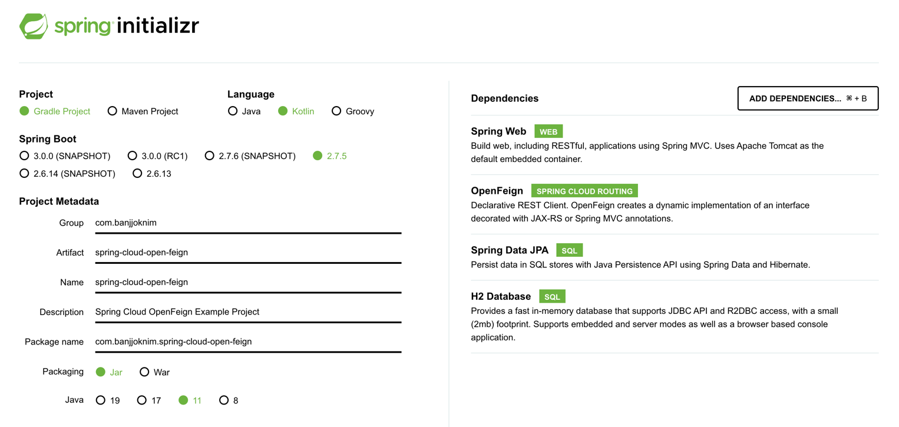

# Spring Cloud Open Feign

## 프로젝트 구성

- [Spring initializr](https://start.spring.io/) 에서 프로젝트 생성.
- 아래 사진은 프로젝트 구성 Dependencies.

## 요구사항
- 회원은 닉네임을 가진다. 
- 닉네임은 10글자 이내여야 한다. 
- 닉네임은 공백이 아니어야 한다.
- 회원은 닉네임을 변경할 수 있어야 한다.

## 참고자료 
- [Introduction to Spring Cloud OpenFeign](https://www.baeldung.com/spring-cloud-openfeign)
- [Spring Cloud OpenFeign](https://spring.io/projects/spring-cloud-openfeign)
