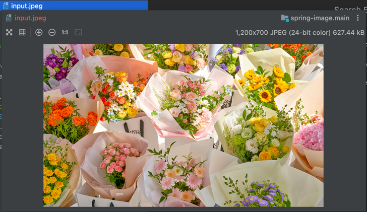
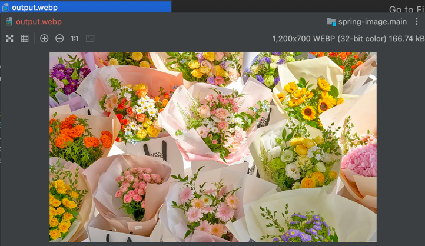

# Spring Image

이미지 처리의 기본적인 것들을 구현한다.

## 이미지 업로드

## 이미지 다운로드

## 이미지 삭제

## 썸네일 생성

[변환 전 - 1200 x 700, 627.44kB, input.jpeg]

[변환 후 - 1200 x 700, 166.74kB, output.webp]

- webp 타입 처리
- [webp-imageio plugin](https://github.com/sejda-pdf/webp-imageio)
