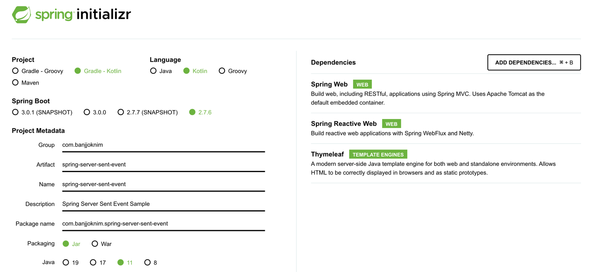

# Spring Server Sent Event

## 프로젝트 구성

- [Spring initializr](https://start.spring.io/) 에서 프로젝트 생성.
- 아래 사진은 프로젝트 구성 Dependencies.
- `Spring Web` 환경은 `Netty(WebFlux)` 와 `Tomcat(WebMvc)` 기반이 존재하며, 두 가지 의존성이 모두 존재할 경우 `Tomcat(WebMvc)` 이 우선순위를 갖는다.
    - 따라서 `WebFlux` 환경을 테스트하고자 한다면 `build.gradle.kts`
      의 `implementation("org.springframework.boot:spring-boot-starter-webflux")`
      의존성을 주석처리 하도록 한다.

## 요구사항

- 웹뷰(클라이언트)에서 사용자 접속시 다른 유저들에게 실시간으로 서버로부터 알림을 제공받는 기능을 구현한다.
- 이때 서버에서는 Server Sent Event 를 이용해서 알림을 반응형으로 제공한다.

## 참고자료

- [Spring에서 Server-Sent-Events 구현하기](https://tecoble.techcourse.co.kr/post/2022-10-11-server-sent-events/)
- [스프링 웹플럭스(WebFlux) SSE(Server Sent Event) 구현 1](https://javacan.tistory.com/entry/spring-webflux-server-sent-event-1)
- [스프링 웹플럭스(WebFlux) SSE(Server Sent Event) 구현 2](https://javacan.tistory.com/entry/spring-webflux-server-sent-event-2)
- [Server-Sent Events in Spring](https://www.baeldung.com/spring-server-sent-events)
- [Spring Event와 SSE 로 리액티브하게 접근하기 (EventListener, Server-Sent Events, 비동기 컨트롤러, RxJava로 동일하게 재구현)](https://sjh836.tistory.com/181?category=680970)
- [[Spring WebFlux] 프로젝트에서 SSE 구현 예시](https://ch4njun.tistory.com/m/264)
- [Spring Boot, SSE(Server-Sent Events)로 단방향 스트리밍 통신 구현하기](https://jsonobject.tistory.com/558)
- [Spring WebFlux (Flux): how to publish dynamically](https://stackoverflow.com/questions/51370463/spring-webflux-flux-how-to-publish-dynamically)
- [Chat application in Spring Boot with Server Sent Events (SSE)](https://christianoette.com/en/blog/blog-post/2022-07-22-ssedemo)
